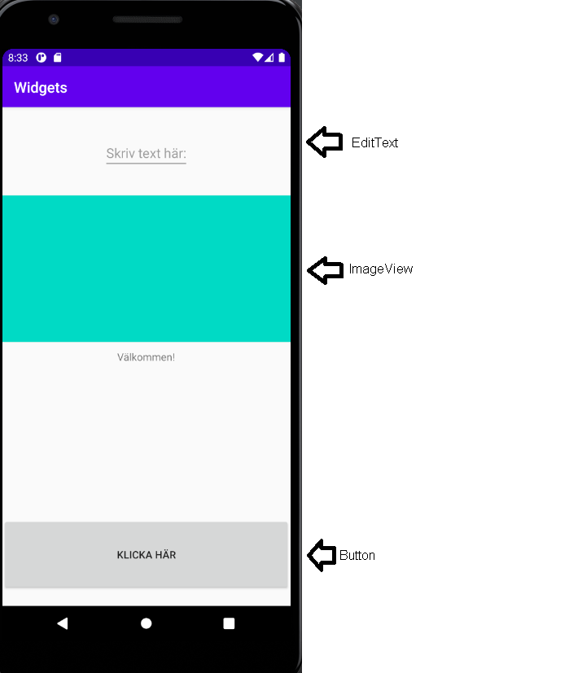

# Rapport dugga 3

I denna dugga har vyer lagts till. Den första vyn som lades till var en EditText-view.  
**EditText**  
I denna vy får användaren av appen skriva in text med sitt tagentbord. Alla vyer använder sig utav en constraint layout. I koden nedan ser vi att elementen ska anpassa  
sig efter förälder-elementet när det gäller positionering. Den har en contraint to left of, to top of & to right of. Vilket innebär att elementet kommer att placera sig  
högst upp. Den har även en margin på toppen. Bredden och höjden är av wrap content. Det vill säga att den tar endast upp så mycket plats den behöver.
```
   <EditText
       app:layout_constraintLeft_toLeftOf="parent"
       app:layout_constraintRight_toRightOf="parent"
       app:layout_constraintTop_toTopOf="parent"
       android:layout_marginTop="40dp"
       android:hint="Skriv text här:"
       android:layout_width="wrap_content"
       android:layout_height="wrap_content"

        />
```
**ImageView**
Denna vy används för att lägga till bilder. Här används en width "match-parent". Det vill säga att den ska matcha sin förälder i detta fallet är föräldern hela skärmen
och elementet kommer vara lika brett som skärmen. Höjden ska vara 200dp. Det används också en margin för att placera elementet längre ner. Här används också positionering
i form av constraint to top of, to left of, to right of. Vilket innebär att elementet kommer även här hamna högst upp. Dock med hjälp utav margin så kommer detta placera sig
under EditText vyn. Bilden innehåller en src som i detta fallet är en färg. Denna färgen är förbestämd i @color och i detta fallet är färgen turkos.

```
   <ImageView

        android:layout_width="match_parent"
        android:layout_height="200dp"
        android:layout_marginTop="120dp"
        app:layout_constraintTop_toTopOf="parent"
        app:layout_constraintLeft_toLeftOf="parent"
        app:layout_constraintRight_toRightOf="parent"
        android:src="@color/colorAccent" />
 
```

**Button**

För att skapa en knapp används Button vyn. Det skapas då en klickbar knapp. Denna knappen använder sig utav ett id med namn knapp vilket skapar möjlighet att manipulera
knappen i Java. Bredden är satt till match_parent vilket har beskrivits tidigare. Heighten är 100dp. Positionering på elementen är likt ovan. Istället för to top of
används här to bottom of parent. Vilket innebär att knappen kommer placera sig i botten. Det används även en margin för att få upp knappen lite ifrån botten.

```
   <Button
        android:id="@+id/knapp"
        android:layout_width="match_parent"
        android:layout_height="100dp"
        android:text="Klicka här"
        app:layout_constraintBottom_toBottomOf="parent"
        app:layout_constraintLeft_toLeftOf="parent"
        app:layout_constraintRight_toRightOf="parent"
        android:layout_marginBottom="20dp"


        />
 
```

Knappen har sedan manipulerats i Java. Där först en variabel har skapats med datatypen Button. Variablen namnges med button. I onCreate tilldelas sedan variablen button  
värdet i id: knapp. Vilket vi döpte idt till i skapandet av vyn. Sedan används en button.setOnClickListener. Denna funktionen skapar möjlighet att påverka vad som händer  
när man klickar på knappen. I funktionen hittar vi en "public void onClick(view V)" i denna funktionen läggs information om vad som ska hända när knappen klickas på.  
I detta fallet kommer knappen att ändra text till "Hej hej" när ett knapptryck sker.

```
public class MainActivity extends AppCompatActivity {
    Button button;
    @Override
    protected void onCreate(Bundle savedInstanceState) {
        super.onCreate(savedInstanceState);
        setContentView(R.layout.activity_main);

        button = findViewById(R.id.knapp);
        button.setOnClickListener(new View.OnClickListener() {
            @Override
            public void onClick(View v) {

                button.setText("Hej hej");
            }
        });

```

Bilder läggs i samma mapp som markdown-filen.




